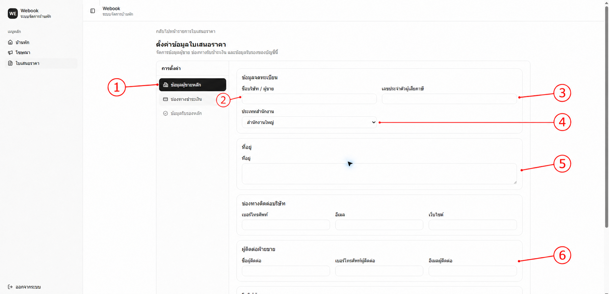
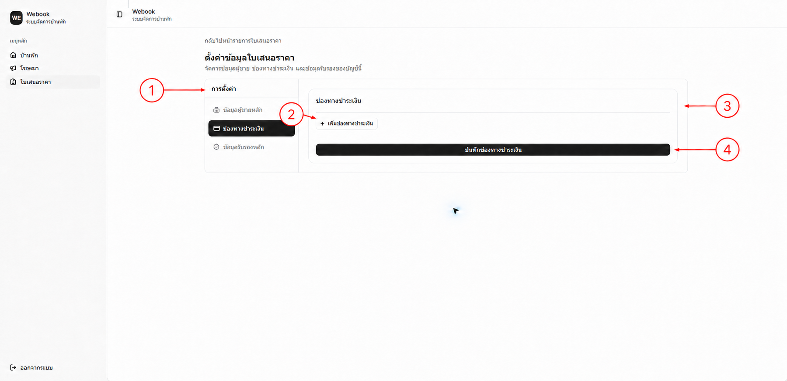
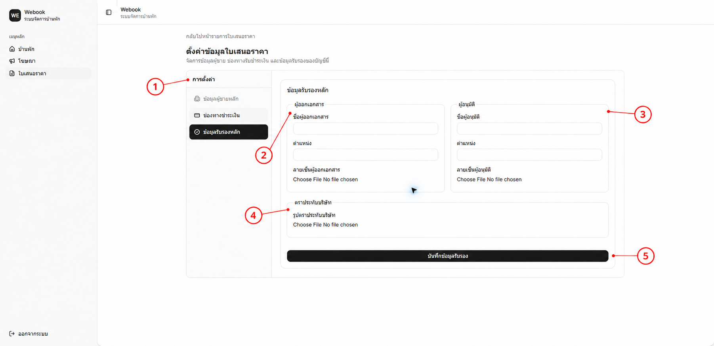
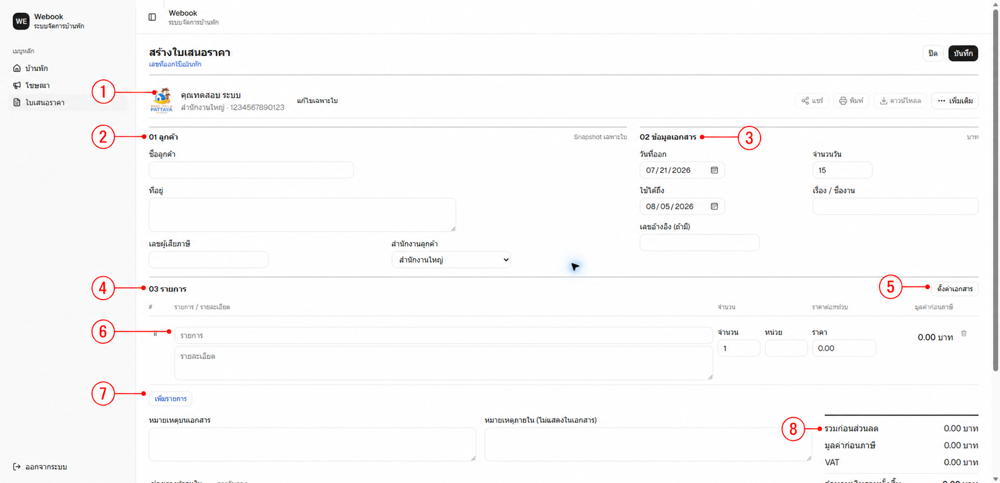
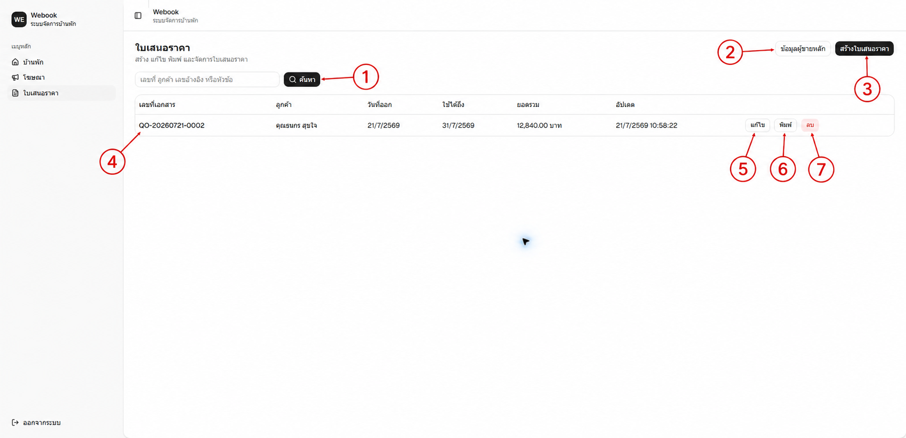

# คู่มือผู้ใช้ระบบใบเสนอราคา

ฉบับย่อสำหรับผู้ดูแลระบบ Webook  
ปรับปรุงล่าสุด: 22 กรกฎาคม 2026

ระบบนี้ใช้สำหรับตั้งค่าข้อมูลผู้ขาย สร้างและแก้ไขใบเสนอราคา พิมพ์ ดาวน์โหลด PDF และแชร์ให้ลูกค้าดูแบบ Public Read-only

## 1. ก่อนสร้างใบเสนอราคา

เข้าสู่ระบบ แล้วเปิดเมนู **ใบเสนอราคา > ข้อมูลผู้ขายหลัก** ผู้ใช้ต้องบันทึกข้อมูลผู้ขายอย่างน้อยหนึ่งครั้งก่อนสร้างเอกสารใบแรก

### 1.1 ข้อมูลผู้ขายหลัก

**หมายเลขในภาพ:**

- **1** แถบการตั้งค่าข้อมูลใบเสนอราคา
- **2** ชื่อบริษัทหรือผู้ขาย
- **3** เลขประจำตัวผู้เสียภาษี
- **4** ประเภทสำนักงาน: ไม่ระบุ สำนักงานใหญ่ หรือสาขา
- **5** ที่อยู่ผู้ขาย
- **6** ช่องทางติดต่อ

กรอกชื่อ ที่อยู่ และเลขภาษี 13 หลักให้ครบ ช่องเลขสาขาจะเปิดให้กรอกเมื่อเลือก **สาขา** เท่านั้น ค่าเริ่มต้นคือ **สำนักงานใหญ่** จากนั้นกดบันทึก ข้อมูลนี้จะถูกคัดลอกลงใบใหม่เป็น Snapshot และยังแก้เฉพาะใบได้

### 1.2 ช่องทางชำระเงิน

**หมายเลขในภาพ:**

- **1** แถบการตั้งค่า
- **2** เพิ่มช่องทางชำระเงิน
- **3** รายการช่องทางที่เพิ่มไว้
- **4** บันทึกช่องทางชำระเงิน

รองรับบัญชีธนาคาร, PromptPay, QR Payment, เงินสด และช่องทางอื่น กรอกเฉพาะข้อมูลที่ต้องการแสดงบนเอกสาร แล้วกดบันทึก

### 1.3 ข้อมูลรับรอง

**หมายเลขในภาพ:**

- **1** แถบการตั้งค่า
- **2** ผู้ออกเอกสารและลายเซ็น
- **3** ผู้อนุมัติและลายเซ็น
- **4** ตราประทับบริษัท
- **5** บันทึกข้อมูลรับรอง

ข้อมูลรับรองไม่บังคับ กรอกเฉพาะส่วนที่ต้องการให้ปรากฏในใบเสนอราคา

## 2. สร้างใบเสนอราคา

เปิด **ใบเสนอราคา > สร้างใบเสนอราคา**

**หมายเลขในภาพ:**

- **1** ข้อมูลผู้ขายของใบนี้
- **2** ข้อมูลลูกค้า
- **3** วันที่และข้อมูลเอกสาร
- **4** รายการสินค้าและบริการ
- **5** ส่วนลดและ VAT ของแต่ละรายการ
- **6** ชื่อและรายละเอียดรายการ
- **7** เพิ่มรายการ
- **8** สรุปยอด

กรอกข้อมูลตามลำดับ:

- ลูกค้า: ชื่อ ที่อยู่ เลขภาษี 13 หลัก และประเภทสำนักงาน
- เอกสาร: วันที่ออก จำนวนวันเริ่มต้น 7 วัน (ช่องนี้แก้ไขไม่ได้) วันที่ใช้ได้ถึง เรื่องหรือชื่องาน และเลขอ้างอิงถ้ามี โดยช่องที่เว้นว่างจะไม่แสดงในใบ
- รายการ: เลือกชื่อรายการ จำนวน ราคาต่อหน่วย และหน่วยถ้ามี
- หมายเหตุ: หมายเหตุบนเอกสารจะแสดงให้ลูกค้าเห็น ส่วนหมายเหตุภายในไม่แสดง

ส่วนช่องทางชำระเงินและการรับรองเริ่มต้นแบบซ่อน ใช้ปุ่ม **แสดง/ซ่อน** ปุ่มเดียว และระบบจะเปิดแท็บที่เกี่ยวข้องอัตโนมัติเมื่อพบข้อมูลไม่ถูกต้อง

ชื่อรายการเลือกได้เฉพาะ **ค่าที่พัก (ลูกค้าชำระเงินครั้งที่ 1/2)**, **ค่าที่พัก (ลูกค้าชำระเงินครั้งที่ 2/2)**, **ค่าที่พัก (ลูกค้าชำระเงินเต็มจำนวน)**, **ค่าบริการ** หรือ **ประกันความเสียหาย** เมื่อเลือก ระบบจะแทนรายละเอียดด้วยชื่อรายการทุกครั้ง จากนั้นยังแก้รายละเอียดได้

ส่วนลดและ VAT แสดงให้ตั้งค่าในทุกรายการเสมอ VAT เลือกได้เฉพาะ **7%**, **0%** หรือ **ไม่มี** ระบบคำนวณส่วนลด VAT ภาษีหัก ณ ที่จ่าย และยอดชำระให้อัตโนมัติ จำนวนต้องมากกว่า 0 และราคาห้ามติดลบ

## 3. บันทึก พิมพ์ และแชร์

- **ดูตัวอย่าง** แสดงข้อมูลร่างล่าสุดบนหน้าจอ
- **พิมพ์** และ **ดาวน์โหลด PDF** ใช้ข้อมูลที่บันทึกล่าสุด
- **แชร์** ใช้ได้หลังบันทึก และเปิดหน้า Public แบบอ่านอย่างเดียว

หากแก้ข้อมูลแล้ว ควรกด **บันทึก** ก่อนพิมพ์ ดาวน์โหลด หรือแชร์ทุกครั้ง หน้า Public ไม่แสดงหมายเหตุภายใน

## 4. ค้นหา แก้ไข และลบ

**หมายเลขในภาพ:**

- **1** ค้นหาใบเสนอราคา
- **2** เปิดข้อมูลผู้ขายหลัก
- **3** สร้างใบใหม่
- **4** รายการเอกสาร
- **5** แก้ไข
- **6** พิมพ์
- **7** ลบ

ใบใหม่ใช้เลขรูปแบบ `QO-YYYYMMDD0001` การแก้ไขใช้เลขที่เอกสารเดิม รวมถึงใบเก่าที่ใช้รูปแบบเดิม การลบเป็น Soft Delete และทำให้ลิงก์ Public เปิดไม่ได้ เลขที่เอกสารเดิมจะไม่นำกลับมาใช้ใหม่

## 5. เมื่อใช้งานไม่ได้

- สร้างเอกสารไม่ได้: ตรวจข้อมูลผู้ขาย ลูกค้า และต้องมีอย่างน้อยหนึ่งรายการ
- แชร์หรือดาวน์โหลดไม่ได้: บันทึกเอกสารและตรวจว่าไม่มีข้อมูลแก้ไขค้างอยู่
- อัปโหลดรูปไม่ได้: ใช้ PNG, JPEG หรือ WebP และตรวจขนาดไฟล์ตามข้อความบนหน้าจอ

## 6. ตรวจสอบก่อนส่งลูกค้า

- ชื่อ ที่อยู่ เลขภาษี และสาขาถูกต้อง
- วันที่ รายการ ราคา ส่วนลด VAT และยอดชำระถูกต้อง
- บัญชีรับเงิน ลายเซ็น และตราประทับถูกต้อง
- บันทึกแล้วเปิด Preview หรือ PDF ตรวจอีกครั้ง
- ทดลองเปิดลิงก์ Public ก่อนส่ง
